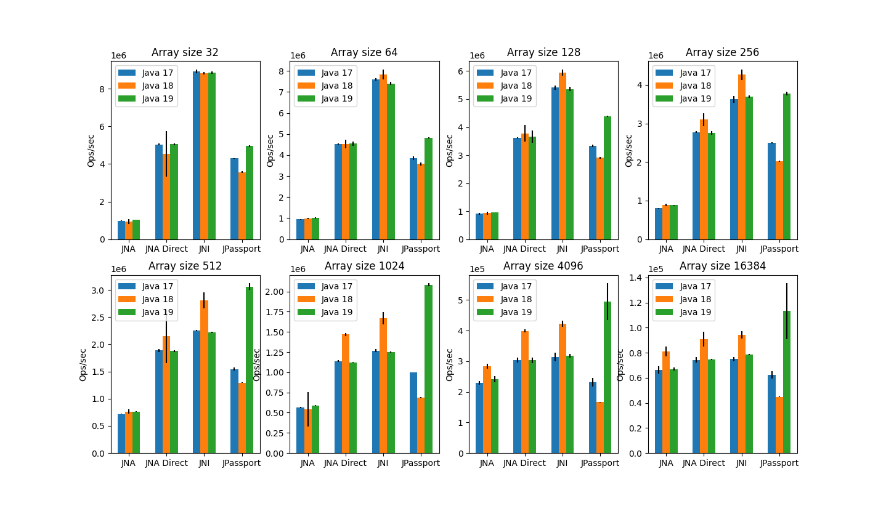

# Native Performance Test

This code is an attempt at comparing the performance of various
Java methods for interacting with native code. The native code access
methods tested are:

- JNA
- JNA Direct
- JNI
- Foreign Linker API (using JPassport)

The testing I did was on Win 10 with and i7-10850H.

The tests look at the overhead in passing arrays of various sizes 
as well as passing primitives.

The method called here passes 2 doubles to the native code and the native code sums them:

JNI and The Foreign Linker are neck and neck for passing a primitive.

The next method I tried accepted an array of doubles and sums the first 5 elements. Only
the first 5 elements are summed in order to a) make sure the method isn't a no-op, b) as
much as possible to compare the transfer time to native only without native time affecting
things.

Interestingly, at very small array sizes JNI is the clear leader, but that lead is lost
to the Foreign Linker API (JPassport) when the arrays get larger. I'm surprised how
much Java 19 improved performance.

It's actually quite impressive here that JNA Direct competes so closely to custom JNI code. 
