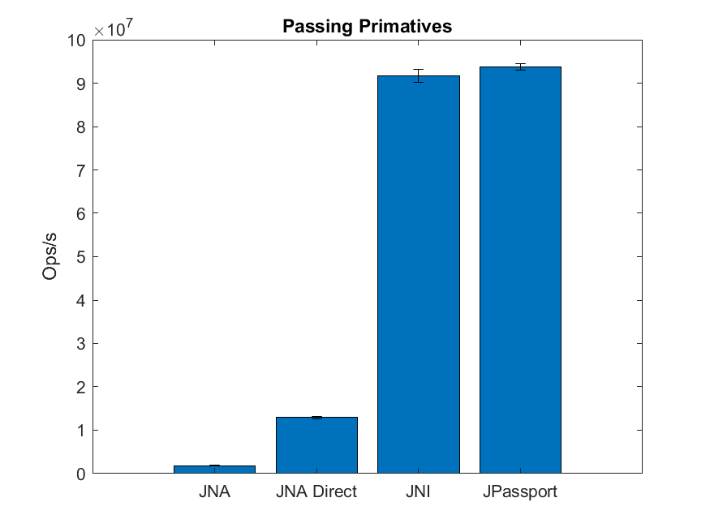
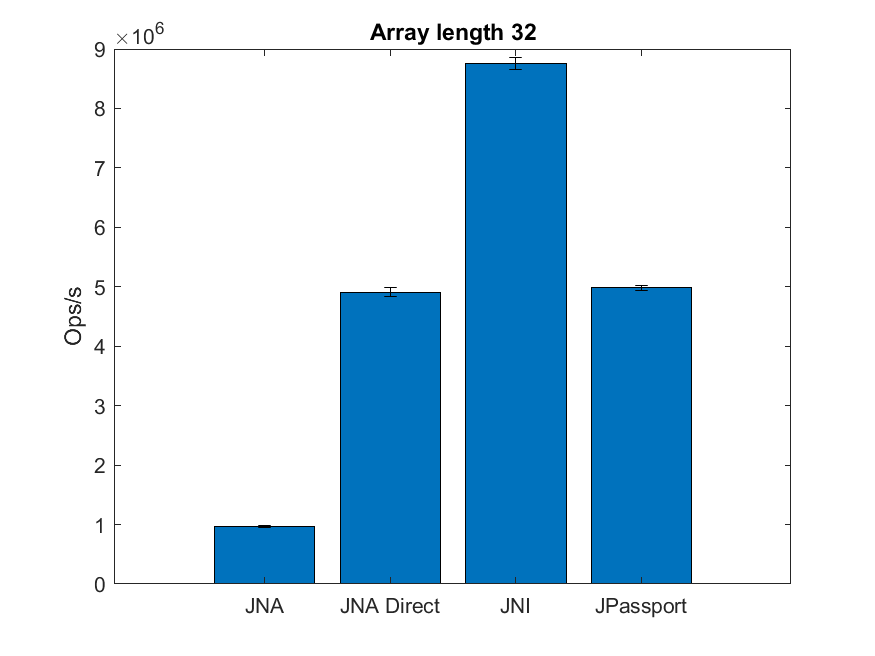
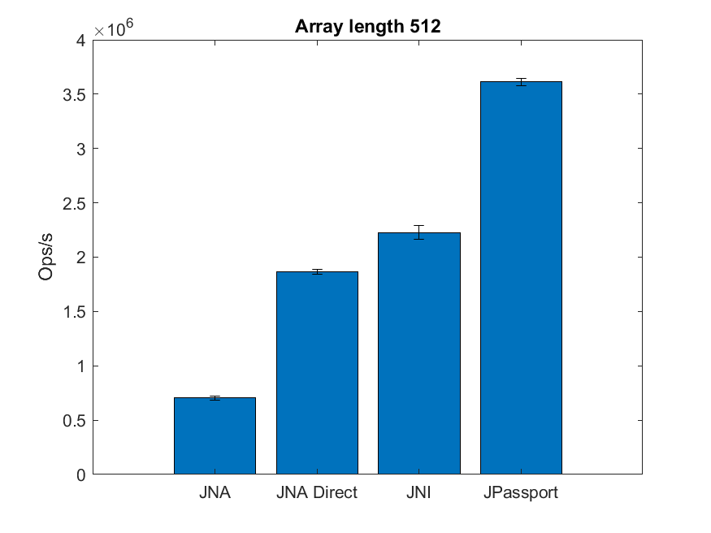
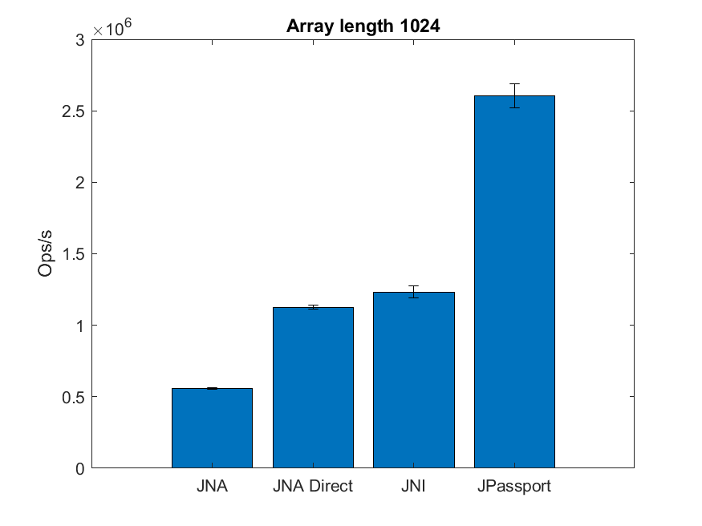
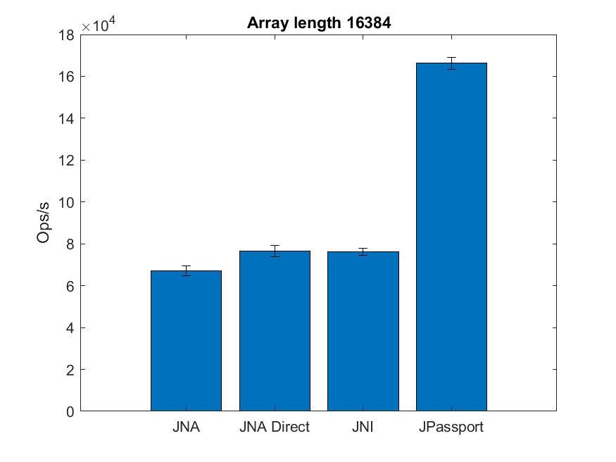

# Native Performance Test

This code is an attempt at comparing the performance of various
Java methods for interacting with native code. The native code access
methods tested are:

- JNA
- JNA Direct
- JNI
- Foreign Linker API (using JPassport)

The testing I did was on Win 10 with and i7-10850H.

The tests look at the overhead in passing arrays of various sizes 
as well as passing primatives.

The results for passing primatives (a double) are:

| Benchmark   | Mode   | Cnt |          Score |               Error | Units |
|---|---|-----|---------------:|--------------------:|----|
| TestPrimativeMain.sumDJava   | thrpt  | 5   |     1782358674 |      ± 46727598 | ops/s |
| TestPrimativeMain.sumDJNA  |  thrpt | 5   |        1844900 |        ± 128607 | ops/s |
| TestPrimativeMain.sumDJNADirect  | thrpt  | 5   |       12900678 |        ± 331764 | ops/s |
| TestPrimativeMain.sumDJNI   | thrpt  | 5   |       91683788 |       ± 1455563 | ops/s |
| TestPrimativeMain.sumDPassport  | thrpt  | 5   |       93783830 | ± 706989 | ops/s |

JNI and The Foreign Linker are neck and neck for passing a primative.

The results for passing arrays of double are:

| Benchmark   | (array_size) | Mode   | Cnt |        Score |        Error | Units |
|---------------------------|-------------:|---|---|-------------:|-------------:|---|
|TestArrMain.sumArrDJava |           32 |  thrpt |    5| 91334755.748 | ± 775844.570 |  ops/s |
|TestArrMain.sumArrDJava |          512 |  thrpt |    5|  2485175.415 | ±  10049.625 |  ops/s |
|TestArrMain.sumArrDJava |         1024 |  thrpt |    5|  1169852.568 | ±  60076.255 |  ops/s |
|TestArrMain.sumArrDJava |        16384 |  thrpt |    5|    70040.174 | ±    319.466 |  ops/s |
|TestArrMain.sumArrDJNA |            32 |  thrpt |    5 |    939071.844 | ±   3132.623 |  ops/s|
|TestArrMain.sumArrDJNA |           512 |  thrpt |    5 |    410847.065 | ±   3000.923 |  ops/s|
|TestArrMain.sumArrDJNA |          1024 |  thrpt |    5 |    258584.836 | ±   6857.975 |  ops/s|
|TestArrMain.sumArrDJNA |         16384 |  thrpt |    5 |     20622.942 | ±    177.096 |  ops/s|
|TestArrMain.sumArrDJNADirect |      32 |  thrpt |    5 |   3991461.961 | ±  21470.081 |  ops/s|
|TestArrMain.sumArrDJNADirect |     512 |  thrpt |    5 |    653279.121 | ±  14194.016 |  ops/s|
|TestArrMain.sumArrDJNADirect |    1024 |  thrpt |    5 |    346008.965 | ±   3585.143 |  ops/s|
|TestArrMain.sumArrDJNADirect |   16384 |  thrpt |    5 |     21723.386 | ±    359.314 |  ops/s|
|TestArrMain.sumArrDJNI |            32 |  thrpt |    5 |   6171303.185 | ±  44771.249 |  ops/s|
|TestArrMain.sumArrDJNI |           512 |  thrpt |    5 |    696180.547 | ±   4546.553 |  ops/s|
|TestArrMain.sumArrDJNI |          1024 |  thrpt |    5 |    358446.851 | ±   1538.227 |  ops/s|
|TestArrMain.sumArrDJNI |         16384 |  thrpt |    5 |     21872.639 | ±    428.542 |  ops/s|
|TestArrMain.sumArrDPassport |       32 |  thrpt |    5 |   3950836.382 | ±  31398.142 |  ops/s|
|TestArrMain.sumArrDPassport |      512 |  thrpt |    5 |    752707.648 | ±  15634.507 |  ops/s|
|TestArrMain.sumArrDPassport |     1024 |  thrpt |    5 |    404050.357 | ±   2200.344 |  ops/s|
|TestArrMain.sumArrDPassport |    16384 |  thrpt |    5 |     25093.065 | ±    936.503 |  ops/s|

|                                                                           |                                                                                |
|---------------------------------------------------------------------------|------------------------------------------------------------------------------------|
|  |    |
|  |  |

Interestingly, at very small array sizes JNI is the clear leader, but that lead is lost
to the Foreign Linker API (JPassport) when the arrays get larger. This points towards the
foreign linker potentially working better with machine learning data.

It's actually quite impressive here that JNA Direct competes so closely to custom JNI code. 
